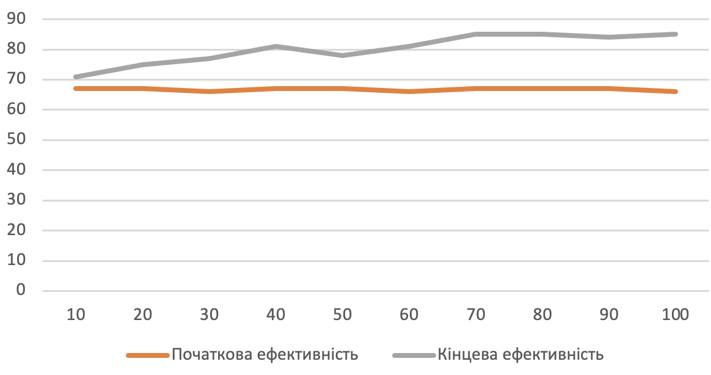
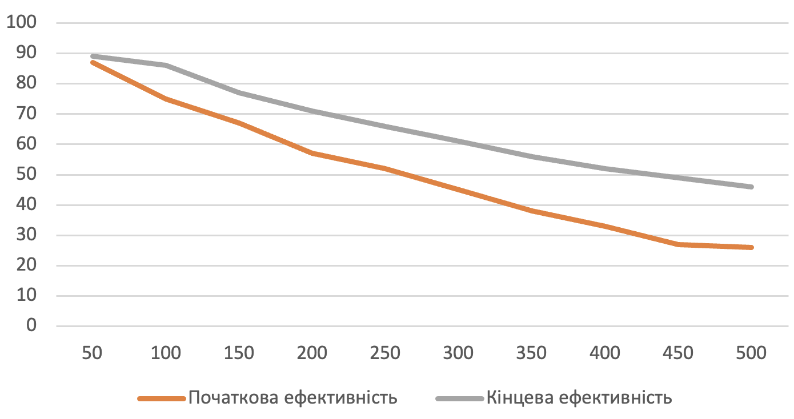
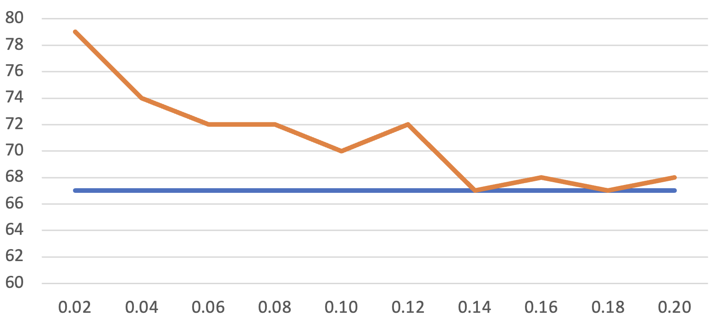

## Комп'ютерні системи імітаційного моделювання
## СПм-23-4, **Перетяка Євгеній Олександрович**
### Лабораторна робота №**1**. Опис імітаційних моделей та проведення обчислювальних експериментів

### Варіант 9, модель у середовищі NetLogo:
[Sheperds](http://www.netlogoweb.org/launch#http://www.netlogoweb.org/assets/modelslib/Sample%20Models/Biology/Shepherds.nlogo)

### Вербальний опис моделі:
Ця модель відтворює поведінку пастухів і овець у середовищі, де пастухи прагнуть згуртувати овець у єдине стадо. У моделі враховано випадковий рух овець та цілеспрямовані дії пастухів, які спрямовують їх до об’єднання. Ефективність створення стада залежить від кількості пастухів та їхньої швидкості відносно овець. Модель дозволяє аналізувати вплив різних чинників, таких як кількість пастухів і характер їхнього руху, на процес групування, а також вивчати ймовірність об’єднання великих стад.

### Керуючі параметри:
- **num-shepherds** - параметр, що визначає кількість пастухів у середовищі під час запуску симуляції. За допомогою слайдера можна змінювати значення цього параметра, тим самим впливаючи на число пастухів, які спробують згуртувати овець у групи під час симуляції.
- **num-sheep** - параметр, що задає кількість овець у середовищі під час запуску симуляції. Використовуючи слайдер, можна налаштувати кількість овець, які будуть випадково рухатися в середовищі під час симуляції. 
- **sheep-speed** - параметр, що визначає швидкість руху овець відносно пастухів. Регулюючи значення цього параметра через слайдер, можна контролювати, з якою швидкістю рухаються вівці порівняно з пастухами під час симуляції.
- 
### Внутрішні параметри:
- **sheepless-neighborhoods** - відображає кількість патчів у середовищі, в яких немає вівців у сусідніх патчах. Вона використовується для вимірювання того, наскільки добре пастухи пасуть вівців.
- **herding-efficiency** - ця змінна використовується для вимірювання того, наскільки ефективно пастухами пасуть овець. Вимірюється відсотками.
- **sheep-nearby** - вказує скільки вівців знаходиться в сусідніх патчах для кожного патча в середовищі.
- **carried-sheep** - вівця, яку несе пастух (або ніхто, якщо не несе)
- **found-herd?** - Ця змінна вказує, чи знайшов пастух групу (стадо) для скидання вівці. Вона встановлюється в true, якщо пастух знайшов групу.
- 
### Показники роботи системи:
- **Current efficiency**: Ефективність утримання стада в даний момент. Ефективність утримання стада вимірюється тут шляхом підрахунку кількості ділянок, у яких немає овець. ефективність = райони без овець / (кількість ділянок - кількість овець) [виражено у відсотках]
- **Herding efficiency**: графік ефективності пастухів.

### Примітки:
- Коли починають формуватися невеликі стада овець, стада ніяк не «захищені», пастухи можуть забирати овець зі стад. Якби стада були «захищені», ви б отримали багато маленьких стад, а не кілька великих
- Якщо пастухів достатньо і/або пастухи рухаються набагато швидше, ніж вівці, кількість стад з часом зменшується.
- Цей проект є хорошим прикладом імовірнісної та децентралізованої стратегії. Немає ні головного пастуха, ні спеціального місця для стад. Рух пастухів і овець і, отже, їхня поведінка є імовірнісними. Кожен пастух дотримується ряду простих правил, але група в цілому виконує досить складні завдання.

### Недоліки моделі:
- Кілька овець можуть перебувати в одному й тому ж місці. Оскільки всі пастухи шукають овець для "збору", один із них може прийти до точки з кількома вівцями, але випадково виявити, що потрібна вівця вже була "забрана" іншим пастухом.
- У реальному житті пастухи часто використовують вівчарок для допомоги у випасі, проте ця модель не передбачає їхньої участі.
- Насправді в моделі пастухи не "підбирають" овець у прямому сенсі. Натомість вони "видаляють" їх у поточному місці, а потім "створюють" нових овець у потрібному місці стада. Такий підхід виглядає доволі штучно та не відображає реальної поведінки.
- Алгоритм руху пастухів є простим і випадковим, без урахування реальних нюансів роботи пастуха.
- Усі пастухи (навіть якщо їх дуже багато, наприклад, 100) намагаються згуртувати овець в одне єдине стадо. Це не є реалістичним, адже в реальному житті для одного стада достатньо кількох пастухів, а на одному полі можуть працювати окремі групи пастухів із різними стадами.

## Обчислювальні експерименти
### 1. Вплив кількості пастухів на ефективність випасання
Досліджується залежність кількості пастухів на ефективність випасання овець через 500 тактів.
Експерименти проводяться при 10-100 пастухів, з кроком 10, усього 10 симуляцій.  
Інші керуючі параметри мають значення за замовчуванням:
- **num-sheep**: 150
- **sheep-speed**: 0.02

<table>
<thead>
<tr><th>Кількість пастухів</th><th>Початкова ефективність</th><th>Кінцева ефективність</th></tr>
</thead>
<tbody>
<tr><td>10</td><td>67</td><td>71</td></tr>
<tr><td>20</td><td>67</td><td>75</td></tr>
<tr><td>30</td><td>66</td><td>77</td></tr>
<tr><td>40</td><td>67</td><td>81</td></tr>
<tr><td>50</td><td>67</td><td>78</td></tr>
<tr><td>60</td><td>66</td><td>81</td></tr>
<tr><td>70</td><td>67</td><td>85</td></tr>
<tr><td>80</td><td>67</td><td>85</td></tr>
<tr><td>90</td><td>67</td><td>84</td></tr>
<tr><td>100</td><td>66</td><td>85</td></tr>
</tbody>
</table>

Висновки експерименту:
- Зі збільшенням кількості пастухів загальна ефективність випасання овець покращується. У цьому експерименті ефективність зросла з 67% на початку до 71–85% наприкінці.
- При невеликій кількості пастухів (наприклад, 10) ефективність також підвищується, але не настільки відчутно, як при більшій кількості пастухів.
- Існує певна межа, після якої додавання пастухів майже не впливає на ефективність або спричиняє лише незначні покращення. Наприклад, збільшення кількості пастухів із 70 до 100 майже не змінює результатів.

### 2.  Вплив кількості овець на ефективність випасання
Досліджується залежність кількості овець на ефективність випасання пастухами через 500 тактів.
Експерименти проводяться при 50-500 пастухів, з кроком 50, усього 10 симуляцій.  
Інші керуючі параметри мають значення за замовчуванням:
- **num-shepherds**: 30
- **sheep-speed**: 0.02

<table>
<thead>
<tr><th>Кількість овець</th><th>Початкова ефективність</th><th>Кінцева ефективність</th></tr>
</thead>
<tbody>
<tr><td>50</td><td>87</td><td>89</td></tr>
<tr><td>100</td><td>75</td><td>86</td></tr>
<tr><td>150</td><td>67</td><td>77</td></tr>
<tr><td>200</td><td>57</td><td>71</td></tr>
<tr><td>250</td><td>52</td><td>66</td></tr>
<tr><td>300</td><td>45</td><td>61</td></tr>
<tr><td>350</td><td>38</td><td>56</td></tr>
<tr><td>400</td><td>33</td><td>52</td></tr>
<tr><td>450</td><td>27</td><td>49</td></tr>
<tr><td>500</td><td>26</td><td>46</td></tr>
</tbody>
</table>

Висновки експеременту:
- Більша кількість овець призводить до більшої розкиданості і розпорошеності стада, що робить випасання менш ефективним.
- Пастухам потрібно більше зусиль та часу, щоб згуртувати та керувати більшим стадом, що впливає на ефективність.
- Чим більше стає овець, тим швидше росте ефективність випасання. Але, загалом, це не суттєво.

### 3. Вплив швидкості овець на ефективність випасання
Досліджується залежність швидкості овець на ефективність випасання пастухами через 500 тактів.
Експерименти проводяться при 0.02 - 0.2 швидкості овець відносно пастухів, з кроком 0.02, усього 10 симуляцій.  
Інші керуючі параметри мають значення за замовчуванням:
- **num-shepherds**: 30
- **num-sheep**: 150

<table>
<thead>
<tr><th>Швидкість овець</th><th>Початкова ефективність</th><th>Кінцева ефективність</th></tr>
</thead>
<tbody>
<tr><td>0.02</td><td>67</td><td>79</td></tr>
<tr><td>0.04</td><td>67</td><td>74</td></tr>
<tr><td>0.06</td><td>67</td><td>72</td></tr>
<tr><td>0.08</td><td>67</td><td>72</td></tr>
<tr><td>0.10</td><td>67</td><td>70</td></tr>
<tr><td>0.12</td><td>67</td><td>72</td></tr>
<tr><td>0.14</td><td>67</td><td>67</td></tr>
<tr><td>0.16</td><td>67</td><td>68</td></tr>
<tr><td>0.18</td><td>67</td><td>67</td></tr>
<tr><td>0.20</td><td>67</td><td>68</td></tr>
</tbody>
</table>

Висновки експеременту:
- Збільшена швидкість овець призводить до більшої розкиданості та розпорошеності стада, що робить випасання менш ефективним.
- Пастухам потрібно більше зусиль та часу, щоб згуртувати та керувати швидкими овцями, що доволі очевидно.
- При високій швидкості овець, пастухи мають більше труднощів у групуванні вівців і веденні їх до одного стада, що призводить до зменшення ефективності. При значеннях швидкості більше 0.12 стадо стає абсолютно некерованим. Хоча навіть при швидкості 0.12 візуально не виглядає, що пастухи мають хоч якийсь контроль.

